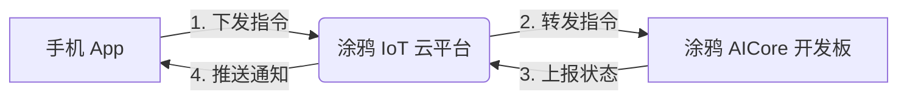

# 🧩 Tuya Eaten Pizza — 拼好时

> **让时间像披萨一样，一块块地消除。**  


*（内置 Miku 图片转换为 GDEH0169E01 六色数据后的理论效果）*

---

## 🌟 核心功能

- ✅ **专注任务双参数设置**（手机 App）：
  - 专注时长：15、30、45、60 或 90 分钟
  - 图块数量：根据专注时长，从 1、3、5、6、9 块中选择合法值
- ✅ **自动计算消除间隔**：
  - 用户不设置时间步长
  - `每块持续时间（分钟） = 专注总时长（分钟） ÷ 图块数量`
  - 固件与面板都会拒绝不合法的“专注时长 + 图块数量”组合
- ✅ **个性化图像支持**：
  - 内置多套主题（ 披萨 / 星空 / 初音未来 ）
  - 图片工具可将任意图片自动裁剪为圆形并转换为六色屏幕数据
  - 自定义面板通过 RAW DP 106 分包上传图片，并显示设备实际接收状态和进度
- ✅ **墨水屏友好设计**：
  - 帧缓冲中只改变已完成扇区，按顺时针逐块消除
  - 当前 GDEH0169E01 六色屏使用厂商示例验证过的全屏刷新波形；一次物理刷新通常约 20 秒
  - 不发送其他屏型的局刷命令，避免花屏、残影或损伤面板
- ✅ **涂鸦 IoT 全链路集成**：
  - App → 云端 → 设备指令下发
  - 计时完成自动推送手机通知
  - 进度实时同步至 App

---

## 📦 硬件清单

本项目基于大连佳显 GDEH0169E01 圆形彩色墨水屏构建，核心组件如下：

| 组件 | 型号 | 说明 |
|------|------|------|
| 彩色墨水屏 | GDEH0169E01 | 400×400 分辨率，6 色，圆形显示 |
| FPC 排线 | FPC-169E01 | 30Pin 排线，连接屏幕与转接板 |
| SPI 转接板 | DESPI-C169 | 集成驱动芯片，支持 SPI 接口通信 |
| 主控开发板 | 涂鸦 T5 AICore 开发板 | 提供 WiFi、MCU、Tuya SDK 支持 |

> ⚠️ 注意：GDEH0169E01 屏幕需搭配 DESPI-C169 转接板才能正常工作，FPC 为必选连接线。电源接口为 3.3V 直流，请勿接入 5V 电源。还需要杜邦线、USB 数据线（烧录程序用）。

---

## 环境搭建

推荐直接使用 TuyaOpen 的 `export.bat` 创建和激活隔离环境；本工程已在 TuyaOpen 自带的 Python 3.12 环境下验证构建成功。需要 Git、CMake、Ninja 和 Make，具体版本由当前 TuyaOpen 安装脚本管理，不需要手动创建 `python3.exe` 符号链接。

---

## ☁️ 涂鸦平台集成说明

本项目严格遵循比赛要求，深度调用涂鸦 IoT 平台服务：

### 1. 产品 DP 点定义
| DP ID | 功能点名称 | 标识符 | 方向 | 数据类型与属性 | 备注 |
|------:|------------|--------|------|----------------|------|
| 101 | 专注时长 | `total_duration` | rw | Enum：`min_15`, `min_30`, `min_45`, `min_60`, `min_90` | 用户选择的专注总时长。与DP102组成合法配置：15→1/3/5块；30→1/3/5/6块；45→1/3/5/9块；60→1/3/5/6块；90→1/3/5/6/9块。每块分钟数=总时长÷图块数量。面板必须成组下发101、102；设备仅接受合法组合，接受后清零DP103、将DP104置为`idle`并回报结果。 |
| 102 | 图块数量 | `piece_count` | rw | Enum：`piece_1`, `piece_3`, `piece_5`, `piece_6`, `piece_9` | 用户选择的图块总数，可选值由DP101决定。面板必须隐藏或禁用非法选项，用户不能设置时间步长。切换时长后，若原块数非法，默认选择新时长允许的最大块数；DP101、DP102必须成组下发，并以设备回报值作为最终设置结果。 |
| 103 | 已消除图块数 | `current_piece` | ro | Value：0～9，间距1，倍数0，单位“块” | 设备当前已经消除的图块数量。开始新任务或修改101、102时清零；每达到一个图块时间节点增加1；完成时等于DP102对应的图块总数。仅在数值变化、配置重置及设备重新上线同步状态时上报，面板不得下发。 |
| 104 | 专注状态 | `timer_status` | rw | Enum：`idle`, `running`, `completed` | `idle`表示待开始或暂停，`running`表示正在计时，`completed`表示全部图块已消除。面板只能下发`idle`和`running`；运行中切换到`idle`会暂停并保留进度，再次下发`running`继续。`completed`只能由设备上报；完成后再次下发`running`时，设备清零进度并开始新任务。 |
| 105 | 显示主题 | `theme` | rw | Enum：`pizza`, `stars`, `miku`, `custom` | 内置主题可直接下发。自定义入口在DP107为`idle`、`ready`或`error`时均可点击；`idle/error`进入选图上传，`ready`可直接使用或更换图片。只有DP107=`ready`时才能下发`custom`。上传完成后设备上报DP107=`ready`、DP108=100及DP105=`custom`。 |
| 106 | 自定义图片数据 | `custom_image` | wr | Raw：单次下发最大128字节 | 400×400六色4-bit帧数据，固定80000字节。像素逐行、从左到右；每字节2像素，高4位为左像素，低4位为右像素；色码：0黑、1白、2黄、3红、5蓝、6绿。每包为`EPZ1`+offset小端uint32+total小端uint32+载荷；前689包载荷116字节，末包76字节，共690包，offset必须连续递增。 |
| 107 | 自定义图片上传状态 | `image_upload_status` | ro | Enum：`idle`, `receiving`, `ready`, `error` | `idle`表示没有可用图片；`receiving`表示正在接收，禁止重复上传、开始专注或切换到`custom`；`ready`表示已完整接收80000字节；`error`表示协议头、长度、offset顺序错误或接收超时。收到offset=0时旧图失效并开始新上传；30秒未收到合法下一包时进入`error`，重传必须从0开始。 |
| 108 | 图片上传进度 | `image_upload_progress` | ro | Value：0～100，间距5，倍数0，单位“%” | 设备实际接收进度。收到合法offset=0首包时上报0；累计进度每跨越5%上报一次。重复包不增加进度；协议头、长度或offset错误时进入`error`。完整接收80000字节后强制上报100；新上传重新从0开始。 |

涂鸦 Enum DP 在固件中按平台枚举列表的位置编码，因此 **DP101、DP102、DP104、DP105、DP107 的枚举顺序必须与上表完全一致**。DP101与DP102必须在同一个对象DP消息中成组下发；固件按“配置 → 主题 → 专注状态”的顺序处理，保证“应用配置并开始”不会被配置重置回`idle`。若只收到101或102、组合非法，或App下发`completed`，固件会拒绝并回报当前有效状态。

方向含义：rw为App/云端可下发且设备可上报，ro为设备只上报，wr为App/云端只下发。DP103、DP107、DP108配置为ro；DP101、DP102、DP104、DP105配置为rw；DP106配置为wr。自定义图片上传必须由自定义面板实现，公版面板不会自动完成本地裁剪、六色转换和690包发送。

[`app-utils/product_dp_schema.json`](./app-utils/product_dp_schema.json) 是本仓库中供固件、面板开发和人工核对使用的“单一协议参考”，记录每个DP的ID、标识符、类型、方向、枚举顺序和跨DP约束。它不是设备授权文件，也不包含PID、UUID或AuthKey；其结构不是涂鸦平台官方导出格式，不能保证可直接通过“导入自定义功能”按钮导入，平台配置仍应逐项以上表为准。

#### App 显示 `dp_xxx` 的处理

`total_duration`、`timer_status`、`theme` 等是协议标识符，固件通信实际使用 DP ID，不能通过修改 C 变量名改变 App 文案。如果公版 App 显示 `dp_timer_status`、`dp_timer_status_idle` 一类内部语言键，请进入该产品的 **产品配置 → 多语言管理 → 产品功能**，为简体中文填写：

| 语言键对应项 | 简体中文显示文案 |
|-------------|------------------|
| DP101及枚举 | 专注时长；15 / 30 / 45 / 60 / 90分钟 |
| DP102及枚举 | 图块数量；1 / 3 / 5 / 6 / 9块 |
| DP103 | 已消除图块数 |
| DP104及枚举 | 专注状态；待机/暂停 / 进行中 / 已完成 |
| DP105及枚举 | 显示主题；披萨 / 星空 / 初音 / 自定义 |
| DP106 | 自定义图片数据 |
| DP107及枚举 | 自定义图片上传状态；未上传 / 接收中 / 已就绪 / 错误 |
| DP108 | 图片上传进度 |

保存后应退出 App 后台并重新打开；若仍显示旧语言键，在 App 设置中清除缓存后重新进入设备面板。产品已经发布时，修改产品功能或面板配置后还需要重新发布/更新面板版本。

### 2. 云端能力调用
- 设备通过 **MQTT over TLS** 连接涂鸦云
- App 通过 **Tuya Smart App SDK** 下发指令
- 设备完成时上报 `timer_status=completed`；在涂鸦 App 中建立“状态变为 completed → 消息提醒”的自动化即可推送通知



---

## 📱 使用流程
1. **硬件连接**  
T5AI核心板用USB供电。

| SPI转接板 | 涂鸦AI板 | 类型  | 说明                                                                    |
| --------- | -------- | ----- | ----------------------------------------------------------------------- |
| GND       | `GND`    | Power | 公共地，必须共地以确保信号参考一致                                      |
| 3V3       | `3V3`    | Power | 为墨水屏模块提供 3.3V 电源                                             |
| BUSY      | `P24`    | GPIO  | 忙状态输入引脚，高电平表示空闲，低电平表示正在刷新                      |
| RES       | `P32`    | GPIO  | 复位引脚（低电平有效），用于重启 EPD 驱动 IC                            |
| DC        | `P03`    | GPIO  | 数据/命令选择引脚：高=数据，低=命令                                     |
| CS        | `P08`    | GPIO  | 主 IC 片选（CSB），控制上半屏（MASTER_ONLY）                            |
| SCL       | `P07`    | GPIO  | SPI 时钟信号（SCLK）                                                    |
| SDA       | `P06`    | GPIO  | SPI 主出从入数据线（MOSI）                                                |
| CSB2      | `P05`    | GPIO  | 从 IC 片选（CSB2），控制下半屏（SLAVE_ONLY）                            |
| MS        | `P04`    | GPIO  | 模块选择/模式控制引脚，用于进入 OTP 校准或特殊初始化模式（非 SPI 片选） |

1. **烧写程序到涂鸦AICore开发板**  
   参考**快速上手**1~5步。

2. **配网**  
   长按开发板按钮 3 秒清除绑定并重新进入 BLE + AP 配网，在 **涂鸦智能 / Smart Life App** 中添加设备。短按按钮用于开始或暂停计时。

3. **设置专注任务**  
   - 在 App 中选择专注时长和该时长允许的图块数量；面板将DP101、DP102成组下发
   - 合法组合：15分钟支持1/3/5块，30分钟支持1/3/5/6块，45分钟支持1/3/5/9块，60分钟支持1/3/5/6块，90分钟支持1/3/5/6/9块
   - 每块持续时间由“专注时长÷图块数量”自动计算，用户不需要也不能单独设置步长
   - 选择内置的披萨、星空或 Miku 主题
   - 将 `timer_status` 设置为 `running` 开始计时
   - 若使用自定义主题，可选择1:1图片；面板转换后通过DP106上传，并通过DP107、DP108显示设备接收状态和进度

4. **专注进行中**  
   - 墨水屏初始显示完整图片
   - 每经过一个自动计算出的图块持续时间，消除下一块并执行一次安全的全屏刷新
   - 圆心数字更新为 `3/6`

5. **专注完成**  
   - 墨水屏显示全白
   - 手机收到通知：“🎯 专注成功！你的图块已全部消除”

---

## 🛠 开发说明

### 目录结构
```
├── 1.69inch_e-paper_E6/          # AICore 板固件（C/C++）
│   ├── examples/
│       ├── main.c                # Tuya IoT、DP 与按键入口
│       ├── eaten_pizza.c         # 计时、拼图、主题与显示任务
│       ├── miku_image.h          # 由根目录 miku.png 转换的 80,000 字节六色资源
│       └── tuya_config.h         # 未烧录硬件授权时使用的云端参数
│   └── lib/
│       ├── Config/               # .\TuyaOpen\examples\e-Paper\1.69inch_e-Paper_E6\lib\Config
│       └── e-Paper/              # 1.69英寸E6墨水屏驱动
│              └── EPD_1in69_E6.c      
│              └── EPD_1in69_E6.h   
│       └── Font/                 # .\TuyaOpen\examples\e-Paper\1.69inch_e-Paper_E6\lib\Font
│       └── GUI/                  # .\TuyaOpen\examples\e-Paper\1.54inch_e-Paper\lib\GUI
│   ├── CMakeLists.txt
│   ├── image.h                   # 示例图片
├── app-utils/         # App 辅助工具（Python/JS）
│   ├── image_processor.py   # 图片裁剪 & 分割
│   ├── pizza_simulator.py   # 400×400 六色墨水屏桌面模拟器
│   ├── miku_e6_preview.png  # 内置 Miku 主题的六色预览
│   ├── run_pizza_simulator.cmd # Windows 双击启动模拟器
│   ├── pizza_layout.json   # 扇区布局配置
│   └── product_dp_schema.json # 产品 DP 配置参考
├── assets/            # 示例图片、演示视频
├── miku.png           # 400×400 Miku 原图
└── README.md          # 项目说明
```

### 快速上手（以Windows为例）
1. 克隆TuyaOpen
   ```bash

   git clone https://github.com/tuya/TuyaOpen.git

   ```
2. 进入examples，克隆本项目
   ```bash
   cd examples
   git clone https://github.com/HPC2H2/Tuya_EatenPizza.git
   ```
3. 在TuyaOpen的目录打开Powershell，激活tos环境（自动安装编译、烧录所需pip库）
   ```bash
   .\export.bat

   ```
4. 进入本项目目录，编译固件
   ```bash
   cd .\examples\Tuya_EatenPizza\eaten-pizza\1.69inch_e-paper_E6
   tos.py build
   ```
5. 在涂鸦开发者平台创建产品并配置 DP。复制 `examples/tuya_config_private.h.example` 为 `examples/tuya_config_private.h`，填入产品 ID；若板载授权区没有对应授权，再填入 UUID 和 AuthKey。私密配置已被 `.gitignore` 排除。

6. 连上涂鸦T5AI板子烧录固件
   ```bash

   tos.py flash
   ```
7. 修改代码后，再执行构建和烧录即可看到效果。

### 桌面显示模拟器

Windows 下双击 `app-utils\run_pizza_simulator.cmd`，即可预览固件理论上应显示的
400×400 六色画面。模拟器复刻了披萨、星空、内置 Miku、自定义图片、扇区消除、
中央进度数字以及面板逐行排列的 80,000 字节 4-bit 编解码流程，并可旋转和导出 PNG。

也可以在已安装依赖的 Python 环境中直接运行：

```powershell
python .\app-utils\pizza_simulator.py
```

内置 Miku 的源文件为根目录下的 `miku.png`；固件实际编译的是转换后的
`1.69inch_e-paper_E6/examples/miku_image.h`，模拟器也读取同一份数组，因此预览与板端使用的数据一致。

### 自定义图片

面板一次只允许选择一张JPG、JPEG、PNG或WebP图片，源文件不超过5MB。图片最终比例为1:1；建议分辨率不低于400×400且不高于4096×4096，非正方形图片先由用户裁剪。面板在手机本地处理EXIF方向、以白色合成透明区域、缩放至400×400，并转换为屏幕六色数据；原始图片不通过DP发送。上传期间应锁定重复上传、开始专注和`custom`主题切换。

安装图片工具依赖并转换：

```powershell
python -m pip install -r .\app-utils\requirements.txt
python .\app-utils\image_processor.py .\my_photo.jpg --output-prefix .\out\my_photo
```

工具会生成400×400六色预览、80,000字节屏幕数据、C头文件和`*_dp106.json`。JSON中的690个Base64包需通过自定义面板按原顺序写入RAW DP106；设备通过DP107上报接收状态，通过DP108按5%步距上报实际接收进度。完整接收后设备将状态置为`ready`、进度置为100%，自动切换到`custom`主题并刷新。包的二进制格式为：

```text
EPZ1（4字节） + offset（uint32 little-endian）
+ total（uint32 little-endian，固定80000） + payload（最多116字节）
```

前689包的payload固定为116字节，最后一包为76字节，总计690包。上传必须从offset 0开始且连续；重复包会被忽略，乱序、长度错误或超过30秒未收到合法下一包会进入`error`，重新上传必须从第一个包开始。收到新上传首包时旧图片立即失效。自定义图片当前保存在运行内存中，设备重启后需要重新上传。
---

## 🎥 演示视频


---

## 📜 License

本项目仅供学习与参赛使用。  
This project uses code from TuyaOpen (https://github.com/tuya/TuyaOpen),
which is licensed under the Apache License, Version 2.0.

---

> Made with ❤️ for the Tuya Eink Application Development Competition 2026
> Developer: HPC2H2
