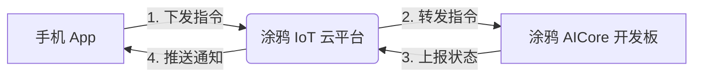

# 🧩 Tuya Eaten Pizza — 拼好时

> **让时间像披萨一样，一块块被吃掉。**  

  
*（示意图：墨水屏逐块去除图块 + 手机 App 设置界面）*

---

## 🌟 核心功能

- ✅ **双参数自由设置**（手机 App）：
  - 总时长：15 ~ 135 分钟
  - 时间步长：1 ~ 15 分钟（每过多久消失一块拼图）
- ✅ **智能拼图生成**：
  - 拼图块数 = `总时长 ÷ 步长`，**最大 9 块**
- ✅ **个性化图像支持**：
  - 内置多套主题（ 披萨 / 星空 / 初音未来 ）
  - **支持用户上传任意图片**，自动裁剪为*圆形*并分割
- ✅ **墨水屏友好设计**：
  - 每步仅**局刷去除拼图块**（<2s），避免 20s 全刷
  - 残影抑制 + 圆形布局优化
- ✅ **涂鸦 IoT 全链路集成**：
  - App → 云端 → 设备指令下发
  - 计时完成自动推送手机通知
  - 进度实时同步至 App

---

## 📦 硬件清单

本项目基于大连佳显 GDEH0169E01 圆形彩色墨水屏构建，核心组件如下：

| 组件 | 型号 | 说明 |
|------|------|------|
| 彩色墨水屏 | GDEH0169E01 | 400×400 分辨率，6 色，圆形显示 |
| FPC 排线 | FPC-169E01 | 30Pin 排线，连接屏幕与转接板 |
| SPI 转接板 | DESPI-C169 | 集成驱动芯片，支持 SPI 接口通信 |
| 主控开发板 | 涂鸦 T5 AICore 开发板 | 提供 WiFi、MCU、Tuya SDK 支持 |

> ⚠️ 注意：GDEH0169E01 屏幕需搭配 DESPI-C169 转接板才能正常工作，FPC 为必选连接线。电源接口为 3.3V 直流，请勿接入 5V 电源。还需要杜邦线、USB 数据线（烧录程序用）。

---

## 环境搭建
  1. Python 3.8 ~ python3.11（3.12及以上不支持，因为移除了distutils库。本工程版本：Python 3.11.9）
  2.  Ninja v1.10+, Make v3.0+, Git v2.0+，CMake v3.0+
  3. 由于涂鸦官方编译脚本里用的“python3”，而windows里只有“python.exe",所以需要在python的安装目录中用CMD运行以下指令：
```bash
mklink python3.exe python.exe
```
该指令为 python3.exe <<===>> python.exe 创建符号链接。

---

## ☁️ 涂鸦平台集成说明

本项目严格遵循比赛要求，深度调用涂鸦 IoT 平台服务：

### 1. 产品 DP 点定义
| DP ID | 名称 | 类型 | 说明 |
|-------|------|------|------|
| 101 | `total_duration` | value | 总时长（秒） |
| 102 | `step_interval` | value | 用户设置的步长（分钟） |
| 103 | `actual_step` | value | 实际使用的步长（分钟） |
| 104 | `piece_count` | value | 拼图总块数（1~9） |
| 105 | `current_piece` | value | 当前已点亮块数 |
| 106 | `timer_status` | enum | `idle` / `running` / `completed` |

### 2. 云端能力调用
- 设备通过 **MQTT over TLS** 连接涂鸦云
- App 通过 **Tuya Smart App SDK** 下发指令
- 完成时触发 **涂鸦自动化场景**，推送系统通知



---

## 📱 使用流程

1. **配网**  
   长按设备按钮进入配网模式，在 **涂鸦 Smart App** 中添加设备。

2. **设置专注任务**  
   - 在 App 中输入：总时长（如 60min）、步长（如 10min）
   - 选择或上传一张图片（建议比例 1:1）
   - 点击“开始专注”

3. **专注进行中**  
   - 墨水屏初始显示空白框架
   - 每 `实际步长` 分钟，**局刷点亮下一块拼图**
   - 屏幕文字更新：“已完成 3/6”

4. **专注完成**  
   - 墨水屏全刷展示完整拼图
   - 手机收到通知：“🎯 专注成功！你的拼图已完整”

---

## 🛠 开发说明

### 目录结构
```
├── growth_puzzle/          # AICore 板固件（C/C++）
│   ├── main.c
│   ├── tuya_dp_handler.c
│   └── eink_driver/
│       ├── gdeh0169e01.c
│       └── partial_refresh.c
├── app-utils/         # App 辅助工具（Python/JS）
│   ├── image_processor.py   # 图片裁剪 & 分割
│   └── puzzle_layout.json   # 布局配置（1~9块坐标）
├── assets/            # 示例图片、演示视频
└── README.md          # 项目说明
```

### 快速上手（以Windows为例）
1. 克隆TuyaOpen
   ```bash

   git clone https://github.com/tuya/TuyaOpen.git

   ```
2. 进入apps，克隆本项目
   ```bash
   cd apps
   git clone https://github.com/HPC2H2/Tuya-GrowthPuzzle.git
   ```
3. 在TuyaOpen的目录打开Powershell，激活tos环境（自动安装编译、烧录所需pip库）
   ```bash
   .\export.bat

   ```
4. 进入本项目目录，编译固件
   ```bash
   cd .\apps\Tuya-GrowthPuzzle\growth_puzzle
   tos.py build
   ```
5. 连上涂鸦T5板子烧录固件
   ` ``bash

   tos.py flash
   ```
6. 修改完本工程的代码后，做3~5步即可看到效果
---

## 🎥 演示视频


---

## 📜 License

本项目仅供学习与参赛使用。  
This project uses code from TuyaOpen (https://github.com/tuya/TuyaOpen),
which is licensed under the Apache License, Version 2.0.

---

> Made with ❤️ for the Tuya Eink Application Development Competition 2026
> Developer: HPC2H2
